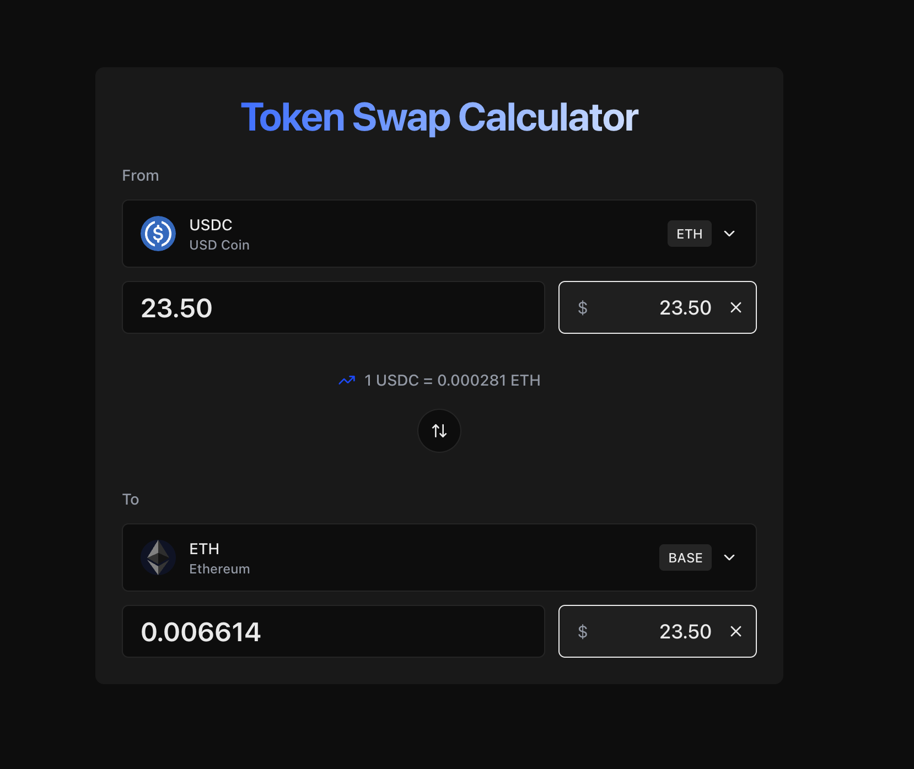
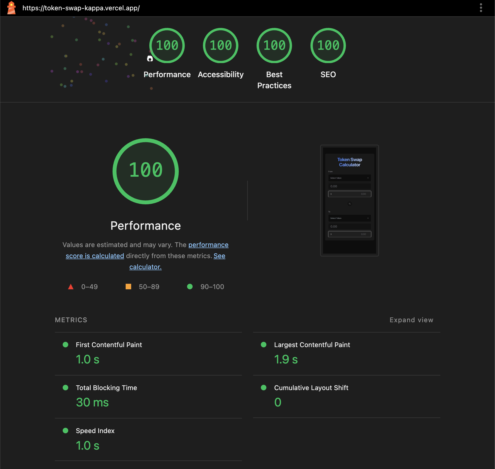

# Token Swap Calculator

A modern, production-ready web application for calculating token swap amounts across multiple blockchain networks. Built with Next.js and React, this application provides real-time token price data and instant conversion calculations with an intuitive, responsive user interface.

🌐 **Live Demo**: [https://token-swap-kappa.vercel.app/](https://token-swap-kappa.vercel.app/)

## 📸 Screenshots

### Application Interface



*The main swap interface showing the bidirectional editable inputs with token amounts and USD values side by side.*

### Performance Metrics



*Lighthouse performance audit showing optimized load times, accessibility, and best practices scores.*

## ✨ Features

- **Bidirectional Editable Inputs**: Edit either token amount or USD value - both update in real-time
- **Real-time Token Pricing**: Live token prices fetched from the Funkit API
- **Multi-Chain Support**: Swap calculations across Ethereum, Polygon, and Base networks
- **Intuitive Token Selection**: Search-enabled dropdown selectors with keyboard navigation
- **Instant Calculations**: Real-time conversion calculations as you type
- **Smart Number Formatting**: Large USD amounts automatically abbreviated (M, B, T)
- **Professional Error Handling**: User-friendly error messages with intelligent retry logic
- **Smooth User Experience**: 
  - Loading skeletons that prevent layout shift
  - Comprehensive error handling with retry functionality
  - Subtle animations and transitions
  - Responsive design for mobile and desktop (stacks vertically on mobile)
- **Type Safety**: Full TypeScript coverage for enhanced reliability
- **Exchange Rate Display**: Real-time conversion rates between selected tokens

## 🛠️ Tech Stack

### Core Framework
- **Next.js 16** - React framework with App Router
- **React 19.2.0** - UI library
- **TypeScript 5** - Type-safe development

### State Management & Data Fetching
- **TanStack Query (React Query) 5** - Server state management with caching and refetching
- **TanStack Query DevTools** - Development debugging tools

### UI & Styling
- **Tailwind CSS 4** - Utility-first CSS framework
- **shadcn/ui** - Accessible component library
- **Framer Motion** - Animation library
- **Radix UI** - Unstyled, accessible component primitives
- **Lucide React** - Icon library

### API Integration
- **@funkit/api-base** - Token data and pricing API

### Testing
- **Jest** - JavaScript testing framework
- **React Testing Library** - React component testing utilities
- **Testing Library User Event** - User interaction simulation

## 📋 Prerequisites

Before you begin, ensure you have the following installed:

- **Node.js** 18+ (20+ recommended)
- **npm** or **yarn** package manager
- **Funkit API Key**

## 🚀 Getting Started

### 1. Clone the Repository

```bash
git clone <repository-url>
cd token-swap
```

### 2. Install Dependencies

```bash
npm install
```

### 3. Environment Configuration

Create a `.env.local` file in the root directory:

```env
NEXT_PUBLIC_FUNKIT_API_KEY=your-api-key-here
```

> **Note**: Replace `your-api-key-here` with your actual Funkit API key.

### 4. Run the Development Server

```bash
npm run dev
```

Open [http://localhost:3000](http://localhost:3000) in your browser to see the application.

### 5. Build for Production

```bash
npm run build
npm start
```

## 📖 Usage

1. **Select Tokens**: Choose the source token (Sell) and target token (Buy) from the dropdowns
2. **Enter Amount**: You can edit either:
   - **Token Amount**: Type the amount of tokens you want to swap
   - **USD Amount**: Type the USD value (shown beside the token amount)
3. **Automatic Conversion**: As you type in either field, the other field updates automatically
4. **View Exchange Rate**: The current exchange rate is displayed between the two sections

### Additional Features

- **Flip Tokens**: Click the circular arrow button between sections to quickly swap source and target tokens
- **Clear Input**: Click the X button in the USD field to clear both amounts
- **Smart Formatting**: Large USD amounts are automatically abbreviated (e.g., 1.5M for $1,500,000)
- **Retry on Error**: If an API call fails, click "Try Again" for retryable errors
- **Real-time Updates**: Token prices automatically refresh every 30 seconds
- **Responsive Design**: On mobile, inputs stack vertically for better usability

## 🧪 Testing & Quality Assurance

This project includes comprehensive testing with a focus on component testing and utility function coverage.

### Test Structure

- **Component Tests** (`tests/components/`): React Testing Library tests for UI components
  - `token-amount-input.test.tsx`: Tests for bidirectional input handling, error states, clear functionality, and user interactions
- **Utility Tests** (`tests/utils/`): Unit tests for business logic
  - `calculations.test.ts`: Tests for swap calculations, token amount calculations, and input validation
  - `format.test.ts`: Tests for number formatting, USD abbreviation (M, B, T), and input parsing
  - `errors.test.ts`: Tests for error categorization and user-friendly error message mapping

### Running Tests

```bash
# Run all tests
npm test

# Watch mode for development
npm run test:watch

# Generate coverage report
npm run test:coverage
```

### Test Coverage

The test suite covers:
- ✅ Component rendering and user interactions
- ✅ Bidirectional input conversion (token amount ↔ USD)
- ✅ Input validation and error handling
- ✅ Calculation logic with edge cases
- ✅ User event simulation (typing, clicking)
- ✅ Error state display and retry functionality
- ✅ Number formatting and abbreviation logic
- ✅ Error categorization and user-friendly messages

### Example Test

```typescript
// Component test example from token-amount-input.test.tsx
it('calls onTokenAmountChange when token amount is typed', async () => {
  const handleChange = jest.fn()
  render(<TokenAmountInput onTokenAmountChange={handleChange} token={mockToken} />)
  
  const input = container.querySelector('input[placeholder="0.00"]')
  await userEvent.type(input, '123')
  
  expect(handleChange).toHaveBeenCalled()
})
```

### Performance Testing

Run Lighthouse audit on the deployed application:

```bash
# Using Lighthouse CLI
npx lighthouse https://token-swap-kappa.vercel.app/ --view
```

The application is optimized for:
- Fast initial load times
- Smooth interactions with memoization
- Efficient API caching with TanStack Query
- Code splitting for optimal bundle sizes

## 📦 Supported Tokens

The application currently supports the following token-chain pairs:

| Token | Chain | Chain ID |
|-------|-------|----------|
| USDC  | Ethereum | 1 |
| USDT  | Polygon | 137 |
| ETH   | Base | 8453 |
| WBTC  | Ethereum | 1 |
| UNI   | Uniswap | 1 |
| LINK  | Chainlink | 1 |
| AAVE  | Aave | 1 |
| MATIC | Polygon | 1 |
| SUSHI | SushiSwap | 1 |

> **Note**: The token list can be easily extended by modifying `lib/config/tokens.ts`.

## 🏗️ Project Structure

```
token-swap/
├── app/                      # Next.js App Router
│   ├── layout.tsx           # Root layout with providers
│   ├── page.tsx             # Main page component
│   └── globals.css          # Global styles and Tailwind imports
├── components/              # React components
│   ├── ui/                  # Reusable UI components (shadcn/ui)
│   │   ├── button.tsx
│   │   ├── card.tsx
│   │   ├── dialog.tsx
│   │   ├── input.tsx
│   │   ├── select.tsx
│   │   └── skeleton.tsx
│   ├── providers/           # Context providers
│   │   └── query-provider.tsx
│   ├── token-amount-input.tsx # Bidirectional editable input (token + USD)
│   ├── swap-interface.tsx   # Main swap interface
│   ├── token-display.tsx    # Token amount display
│   ├── token-input.tsx      # USD input component (legacy)
│   └── token-selector.tsx   # Token selection dropdown
├── lib/                     # Core application logic
│   ├── api/                 # API integration layer
│   │   ├── prices.ts        # Price fetching utilities
│   │   └── tokens.ts        # Token info fetching utilities
│   ├── config/              # Configuration files
│   │   └── tokens.ts        # Supported tokens configuration
│   ├── hooks/               # Custom React hooks
│   │   ├── use-token-info.ts    # Token metadata hook
│   │   └── use-token-prices.ts  # Token prices hook
│   └── utils/               # Utility functions
│       ├── calculations.ts  # Swap calculation logic
│       ├── format.ts        # Number formatting utilities (including USD abbreviations)
│       └── errors.ts        # Error handling and user-friendly message mapping
├── types/                   # TypeScript type definitions
│   └── index.ts
├── tests/                   # Test files
│   ├── components/
│   └── utils/
├── public/                  # Static assets
│   └── assets/              # Token icons
├── next.config.ts           # Next.js configuration
├── tsconfig.json            # TypeScript configuration
├── jest.config.js           # Jest configuration
└── package.json             # Project dependencies
```

## 🔧 Development

### Available Scripts

- `npm run dev` - Start development server
- `npm run build` - Build for production
- `npm start` - Start production server
- `npm run lint` - Run ESLint
- `npm test` - Run tests
- `npm run test:watch` - Run tests in watch mode
- `npm run test:coverage` - Generate test coverage report

### Code Style

The project uses:
- **ESLint** with Next.js configuration for code linting
- **TypeScript** for type checking
- **Prettier** (if configured) for code formatting

## 🎨 Design Philosophy & Product Sense

This application incorporates specific, well-researched UX patterns from industry-leading cryptocurrency platforms:

### UX Patterns from Leading Platforms

#### 1. **Matcha.xyz Patterns**
- **Instant Swap Preview**: Real-time rate updates as users input amounts - no "Calculate" button needed. This reduces friction and provides immediate feedback.
- **Integrated Search Dropdown**: Token selector with inline search functionality (not a modal) for faster interaction. Users can type to filter tokens without opening a separate dialog.
- **Flip Button**: Quick swap between source and target tokens with smooth animation. The circular arrow button provides visual feedback and makes token reversal intuitive.

#### 2. **Coinbase Patterns**
- **Conservative Color Scheme**: Professional grays and blues (#0052ff primary) create a trustworthy, financial-services feel. This color choice builds user confidence.
- **Clear Visual Hierarchy**: Token amount and USD value positioned side by side with clear labels. Information is scannable and the relationship between values is immediately apparent.
- **Skeleton Loaders**: Loading states that match the final content shape prevent layout shift and provide smooth loading experience. Users see the structure before content loads.

#### 3. **Robinhood Patterns**
- **Clean Number Formatting**: Commas and appropriate decimal places (e.g., "1,234.56") make large numbers readable. Formatting adapts based on value size.
- **Smart Abbreviations**: Large USD amounts automatically abbreviated (1.5M, 1.5B, 1.5T) to keep the interface clean and readable.
- **Subtle Hover States**: Scale transforms on interactive elements (flip button, clear button) provide tactile feedback without being distracting.
- **Focus Ring Animations**: Smooth ring animations on input focus create clear visual feedback for keyboard navigation and accessibility.

### Component Architecture

This project follows a **component-driven design** approach:

- **Base UI Components** (`components/ui/`): Reusable, accessible components built on Radix UI primitives
  - `Button`, `Input`, `Select`, `Card`, `Skeleton`, `Dialog`
  - Each component is self-contained and follows shadcn/ui patterns
- **Feature Components** (`components/`): Domain-specific components that compose base components
  - `TokenAmountInput`: Bidirectional editable inputs with token and USD amounts
  - `TokenSelector`: Search-enabled token selection dropdown
  - `SwapInterface`: Main swap interface orchestrating all components
  - Clear separation of concerns: UI, business logic, and API calls
- **Custom Hooks** (`lib/hooks/`): TanStack Query hooks for data fetching
  - Encapsulate API logic and provide clean component interfaces
- **Utilities** (`lib/utils/`): Pure functions for calculations, formatting, and error handling
  - Easily testable, no side effects

### State Management Strategy

- **Server State**: TanStack Query handles all API calls with automatic caching, refetching, and error handling
- **Client State**: React `useState` for UI state (selected tokens, amounts)
- **No Global State**: Avoided Redux/Zustand as the app is simple enough for local state
- **Memoization**: `useMemo` for expensive calculations to prevent unnecessary re-renders
- **Bidirectional Updates**: Smart tracking of which input was last edited to avoid circular updates

## 🚢 Deployment

### Live Application

The application is deployed and available at:

**🌐 [https://token-swap-kappa.vercel.app/](https://token-swap-kappa.vercel.app/)**

### Vercel Deployment

The application is deployed on Vercel with the following configuration:

1. **Automatic Deployments**: Every push to the main branch triggers a new deployment
2. **Environment Variables**: `NEXT_PUBLIC_FUNKIT_API_KEY` is configured in Vercel dashboard
3. **Build Settings**: Uses Next.js default build configuration
4. **Performance**: Optimized for fast load times and smooth interactions

### Manual Deployment

```bash
npm run build
npm start
```

For production environments, ensure:
- Node.js 18+ is installed
- Environment variables are properly configured
- The build completes without errors

## 🐛 Troubleshooting

### API Key Issues

**Problem**: "API key not configured" error

**Solution**:
1. Verify `.env.local` exists in the root directory
2. Check that `NEXT_PUBLIC_FUNKIT_API_KEY` is set correctly
3. Restart the development server after adding environment variables
4. Ensure the API key is valid and has proper permissions

### Token Not Found

**Problem**: Token doesn't appear in the selector

**Solution**:
1. Verify the token is configured in `lib/config/tokens.ts`
2. Check that the chain ID and symbol match the Funkit API
3. Inspect the browser console for API errors
4. Verify the token exists on the specified chain

### Build Errors

**Problem**: Build fails during `npm run build`

**Solution**:
1. Run `npm install` to ensure all dependencies are installed
2. Check TypeScript errors: `npx tsc --noEmit`
3. Verify Node.js version is 18 or higher: `node --version`
4. Clear `.next` directory and rebuild: `rm -rf .next && npm run build`

### Price Not Updating

**Problem**: Token prices don't refresh

**Solution**:
1. Check network connectivity
2. Verify API key is valid and not rate-limited
3. Check browser console for API errors
4. Prices refresh every 30 seconds automatically

## 📝 API Integration

The application uses the Funkit API for token data and pricing:

### Endpoints Used

1. **`getAssetErc20ByChainAndSymbol`**: Fetches token metadata (address, decimals, name)
2. **`getAssetPriceInfo`**: Fetches current token price by chain ID and token address

### Caching Strategy

- **Token Info**: Cached for 5 minutes
- **Token Prices**: Cached for 30 seconds with automatic background refetching

### Error Handling

- **Intelligent Error Categorization**: Backend errors are automatically categorized (network, API key, token not found, etc.)
- **User-Friendly Messages**: Technical errors are mapped to clear, actionable messages
- **Retry Logic**: Only retryable errors (network, rate limit, etc.) show retry buttons
- **Professional Display**: Errors shown in styled cards with icons, not raw backend messages

## 🔐 Security Considerations

- API keys are stored in environment variables (never committed to version control)
- Client-side API calls use `NEXT_PUBLIC_` prefix for Next.js environment variables
- Input validation prevents invalid USD amounts
- TypeScript provides compile-time type safety
- Error messages are sanitized to prevent exposing sensitive backend details

## 📝 Assumptions & Trade-offs

This section documents key design decisions, their rationale, and the trade-offs involved.

### Assumptions

1. **API Key Required**: Assumes users have access to a Funkit API key. The application gracefully handles missing API keys with clear error messages.

2. **Token Addresses from API**: Token addresses are fetched from the API (not hardcoded) to ensure accuracy and support for tokens that may change addresses.

3. **Price Update Frequency**: Prices refresh every 30 seconds - this balances real-time updates with API rate limits and user experience.

4. **USD as Base Currency**: All calculations use USD as the base currency. This simplifies the UX and aligns with common DeFi patterns.

5. **Client-Side Rendering for Token Data**: Token data is fetched client-side to enable real-time updates. This trade-off means slightly slower initial load but better interactivity.

6. **Bidirectional Input Editing**: Both token amount and USD amount are editable. The last edited field determines the conversion direction to avoid circular updates.

### Trade-offs

1. **Limited Token List**: Hardcoded list of 4 tokens (easily extensible via `lib/config/tokens.ts`).
   - **Rationale**: Focused scope for MVP, easier to test and maintain
   - **Trade-off**: Not a comprehensive token list, but architecture supports easy expansion

2. **No Historical Data**: Only shows current prices, not price history or charts.
   - **Rationale**: Scope focused on swap calculation, not analytics
   - **Trade-off**: Less context for users, but faster and simpler implementation

3. **Client-Side Only**: No server-side rendering for token data.
   - **Rationale**: Real-time updates require client-side fetching, simpler deployment
   - **Trade-off**: Slightly slower initial load, but better for dynamic content

4. **No Actual Swap Execution**: This is a calculator/preview tool, not a swap executor.
   - **Rationale**: Scope focused on calculation and UX, not wallet integration
   - **Trade-off**: Users can't execute swaps, but tool is safer and simpler

5. **30-Second Price Refresh**: Prices update every 30 seconds, not on every keystroke.
   - **Rationale**: Balances real-time feel with API rate limits and performance
   - **Trade-off**: Prices may be slightly stale, but reduces API calls and improves performance

6. **Abbreviated Formatting Threshold**: USD amounts >= 1 million are abbreviated (no thousands abbreviation).
   - **Rationale**: Keeps interface clean, most swap amounts are in thousands or millions
   - **Trade-off**: Very large amounts (999M+) might be less precise, but improves readability

7. **Error Message Genericization**: Backend errors are mapped to user-friendly messages.
   - **Rationale**: Better UX, prevents exposing technical details
   - **Trade-off**: Less debugging information for developers, but clearer for end users

### Future Enhancements

If this were to be extended, potential improvements could include:
- Expanded token list with search/filter
- Price history charts
- Server-side rendering for initial token data
- Wallet integration for actual swap execution
- More granular price refresh options
- Dark mode support
- Internationalization (i18n)

## 📄 License

This project is created as a take-home assignment.

## 🙏 Acknowledgments

- **Funkit** - Token data and pricing API
- **shadcn/ui** - Beautiful, accessible component library
- **TanStack Query** - Excellent data fetching patterns
- **Design Inspiration** - Matcha.xyz, Coinbase, and Robinhood

## 🤝 Contributing

This is a take-home assignment project. For questions or issues, please refer to the project maintainer.

---

Built with ❤️ using Next.js and React
